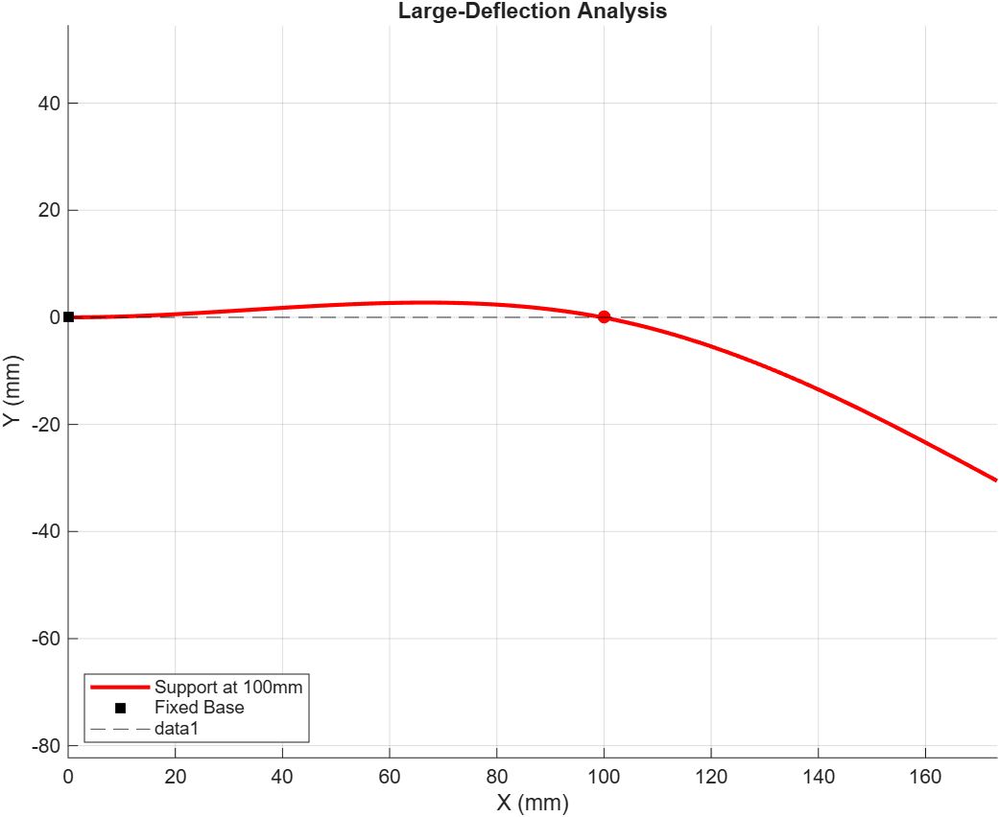

# Large-Deflection Analysis of a 2D Statically Indeterminate Propped Cantilever

PSO-based solver (MATLAB) for the in-plane deflected profile of a propped
cantilever under large deformation. Validated against nonlinear FEA in
ANSYS (2–3% agreement).

## Files
- `Main.m` — runs the solver and plots the profile
- `PSO.m` — particle swarm optimization routine
- `unit_model.m` — segment-wise beam model

Author: Akshat Nama — M.S. Mechanical Engineering, IIT Madras
